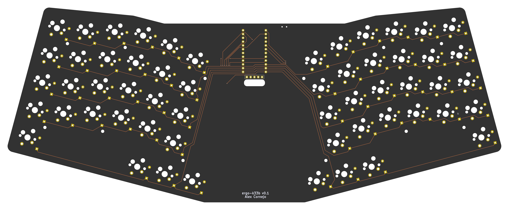
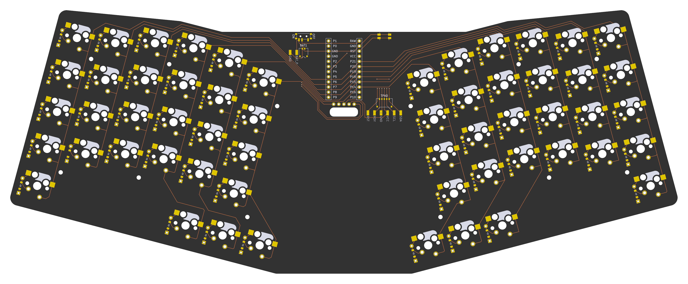
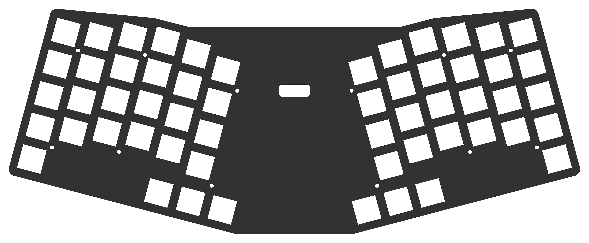
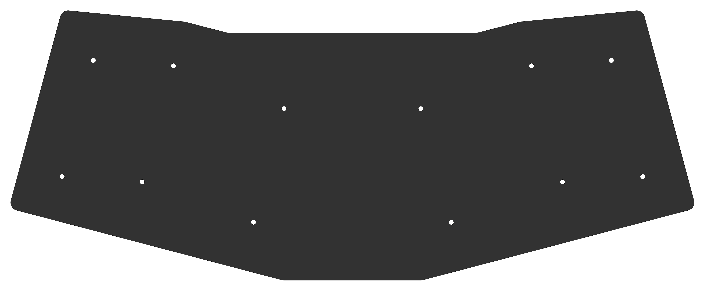
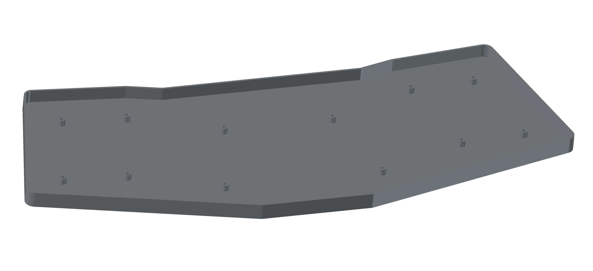

# ergo-k33b

A 56-key split/unified ortholinear keyboard with an integrated trackpad, designed in [Ergogen](https://ergogen.xyz/) and routed manually in KiCad.

## Overview

The ergo-k33b is a custom keyboard PCB featuring a symmetric 6×4 column-staggered matrix on each half, palm modifier keys, a 3-key thumb cluster per side, and an optional 65mm×50mm Azoteq TPS65 trackpad mounted in the center of the board.

The board uses a single unified PCB that mirrors the left and right halves — no split cable required.

## Images

### PCB — Top


### PCB — Bottom


### Front Plate


### Back Plate


### Case


## Key Layout

- **Total keys:** 56 (10 palm keys + 6 thumb keys + 40 matrix keys)
- **Matrix:** 6 columns × 4 rows per side, with column stagger:
  - Outer/pinky columns: +0/+2.5 mm stagger
  - Ring column: +5 mm stagger
  - Middle column: +2.5 mm stagger
  - Index column: −2.5 mm stagger
  - Inner column: −5 mm stagger
- **Thumb cluster:** 3 keys per side, splayed outward from the inner-bottom matrix position
- **Palm keys:** 1 key per side below the outer column, intended for modifier keys
- **Switch type:** Cherry MX (5-pin), with optional hotswap socket support

## Hardware

| Component | Part | Notes |
|---|---|---|
| MCU | [Nice!Nano](https://nicekeyboards.com/nice-nano/) (nRF52840 SuperMini) | Mounted on the back, centered between halves |
| Display | [Nice!View](https://nicekeyboards.com/nice-view/) | Optional; SPI via P1/P2/P3 |
| Trackpad | [Azoteq TPS65](https://www.azoteq.com/) (65mm × 50mm) | Optional; I²C via P4/P5, ready signal P0 |
| Switches | Cherry MX 5-pin | Hotswap and solder options |
| Diodes | SOD-123 (SMD) + THT | Both footprints populated; one per key |
| Battery | JST connector (Molex Pico EZmate 1×2) | Also exposes solder pads (BAT\_P / GND) |
| Power switch | SMD side-mount | On the back of the board |
| Reset button | SMD side-mount | On the back of the board |

## PCB Design

The PCB was designed using [Ergogen](https://ergogen.xyz/) v4.2 to generate the board outline, key positions, and component footprints from `ergogen/config.yaml`. Routing was done manually in KiCad. The freerouting scripts in this repo are provided for experimentation only.

Three PCBs are generated from the Ergogen config:

| PCB | Description |
|---|---|
| `main_board` | The keyboard PCB with all switches, diodes, MCU, and connectors |
| `frontplate` | Switch plate with key cutouts and screw holes |
| `backplate` | Bottom cover plate with screw holes |

A `bottom_case` 3D model (STL) is also generated from the Ergogen outlines using OpenJSCAD.

### Pinout (nRF52840 SuperMini)

| Pin | Function |
|---|---|
| P21 | Column: outer |
| P20 | Column: pinky |
| P19 | Column: ring |
| P18 | Column: middle |
| P15 | Column: index |
| P14 | Column: inner |
| P10 | Row: bottom |
| P8 | Row: home |
| P16 | Row: top |
| P7 | Row: num |
| P9 | Row: thumb cluster |
| P13 | Row: palm keys |
| P0 | Trackpad RDY |
| P4 | Trackpad SCL (I²C) |
| P5 | Trackpad SDA (I²C) |
| P6 | Trackpad RST |
| P1 | Nice!View CS |
| P2 | Nice!View MOSI |
| P3 | Nice!View SCK |

## Repository Structure

```
ergogen/
  config.yaml       # Full Ergogen board definition
output/
  pcbs/             # Generated KiCad PCB files
  cases/            # Generated OpenJSCAD and STL files
  outlines/         # Generated outline DXFs
  gerbers/          # Fabrication outputs
scripts/
  boards.kibot.yaml # KiBot config for main board exports
  default.kibot.yaml# KiBot config for plate exports
  export_dsn.py     # Export KiCad PCB to Specctra DSN
  import_ses.py     # Import Specctra SES back to KiCad
  freerouting.rules # Freerouting design rules
main_board.kicad_pcb # Hand-routed main board (source of truth)
build.sh            # Docker-based build script (KiBot + Freerouting)
images/             # Board renders
```

## Building

### Prerequisites

- [Node.js](https://nodejs.org/) (for Ergogen and OpenJSCAD CLI)
- [Docker](https://www.docker.com/) (for KiBot and Freerouting via containers)

### Generate PCB and case files from Ergogen

```bash
npm install
npm run build
```

This runs Ergogen to regenerate all PCBs, outlines, and case STL files under `output/`.

### Export Gerbers and run autorouting

```bash
./build.sh
```

This uses Docker to:
1. Run [KiBot](https://github.com/INTI-CMNB/KiBot) to export Gerbers for plates and boards
2. Export the board to Specctra DSN format
3. Autoroute with [Freerouting](https://github.com/freerouting/freerouting) (25 passes)
4. Import the routed SES back to KiCad and re-export Gerbers

> **Note:** The hand-routed `main_board.kicad_pcb` at the repo root is the production board. The autorouted output is for experimentation only.

### Clean generated output

```bash
npm run clean
```

## Firmware

The Nice!Nano runs [ZMK Firmware](https://zmk.dev/). Create a ZMK config repo with a shield definition matching the matrix pinout above.

## License

See [LICENSE](LICENSE).
